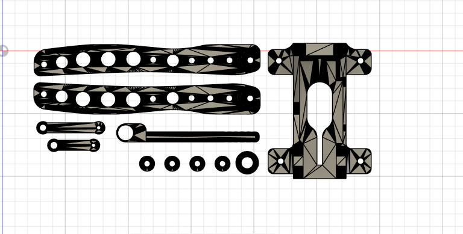
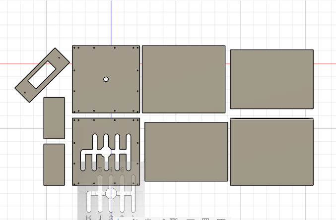
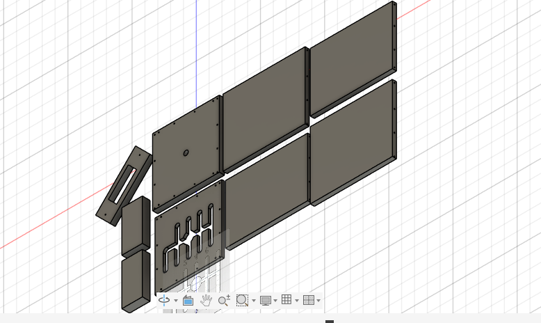
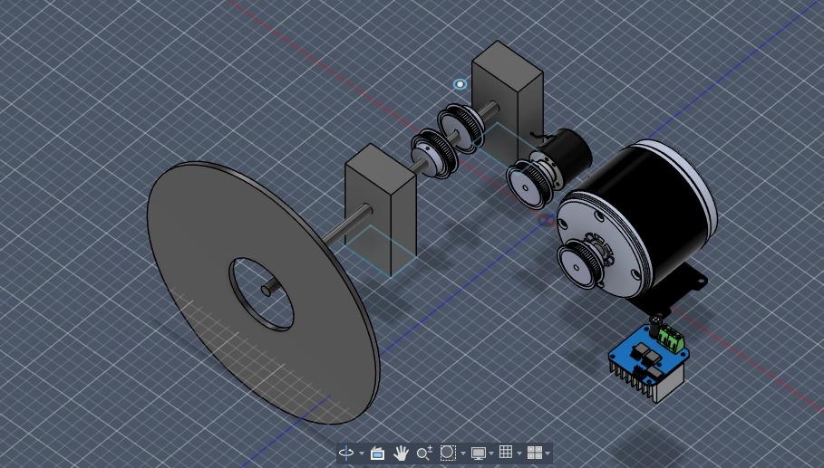
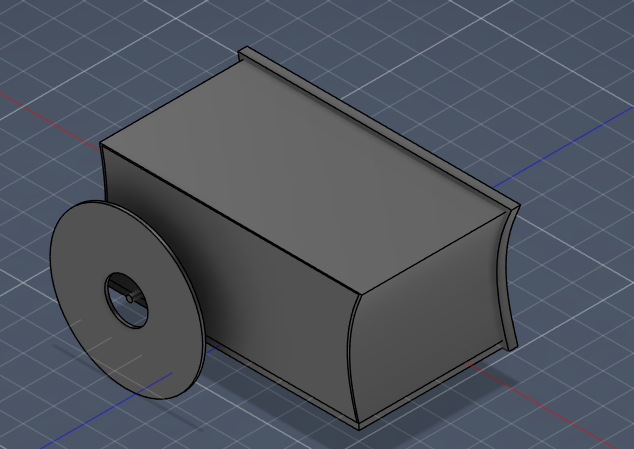

# FFB-Wheel
This is try to make a ffb wheel with foot pedals and h shifter,in most of boad of is can be 3d print,h shifter have 7+1 rev space foot pedals ,accelerator brack clutch and for process we are using arduino leonardo r3 board and in frimware we are using EMC LITE for now 

# How to Use it
First We need to flase the Firmware to our arduino leonardo r3 or STM32 Board what you chose and conncet all the wire to it as show in images and connect to pc with data cable

# Why i make this 
I want to create a very good and cheap FFB wheel so any one Make it and injoy it 
I make padels and H shifter 3d printable file so any one can use it

# Images

.png)

# BOM
| No | Product Name | Quantity | Price per Piece (₹) | Total Price (₹) | Total Price (USD) | Note | Link |
|:---:|---|:---:|:---:|:---:|:---:|---|---|
| 1 | STM32F411CEU6 Minimum System Board | 1 | 314 | 314 | 3.46 | | [Link](https://robu.in/product/stm32f411ceu6-minimum-system-board-microcomputer-stm32-arm-core-board/) |
| 2 | Motor Driver Module | 1 | 314 | 314 | 3.46 | | [Link](https://robu.in/product/double-bts7960-43a-h-bridge-high-power-stepper-motor-driver-module/?gad_source=1&gad_campaignid=21296336107&gbraid=0AAAAADvLFWdJ5EvRBHFr_PVpYdbVosUjy&gclid=CjwKCAiAzOXMBhASEiwAe14SaUT7ghWbRrVe0ad677sHu98S4PzY0OlwIrd5Axm-B5C3EPylXuoskhoCiLQQAvD_BwE) |
| 3 | Pro-Range 600 PPR 2-Phase Incremental Rotary Encoder | 1 | 1552 | 1552 | 17.10 | | [Link](https://robu.in/product/incremental-optical-rotary-encoder-6002400-pulse-600-ppr/) |
| 4 | xcluma MY1016 24V 250W DC Motor High Speeds Small Brush Motor For ebike e-bike, Aluminium | 1 | 3000 | 3000 | 33.05 | | [Link](https://www.amazon.in/dp/B09881BGDK/ref=cm_sw_r_as_gl_apa_gl_i_dl_WTZX32K98ASPPC2XTHFB?linkCode=ml1&tag=techathome0b-21) |
| 5 | potentiometer | 3 | 24 | 72 | 0.79 | | [Link](https://www.flyrobo.in/wh148-10k-ohm-3pin-15mm-shaft-single-potentiometer?tracking=EGXCW2oMhfyBcK6Sk1AJrTIztP2cZx0qc64QgrBQeDUPl0RUIBuMMhQFtnvTOaKj) |
| 6 | 60 Tooth 8mm Bore GT2 Timing Aluminum Pulley for 6mm Belt | 1 | 192 | 192 | 2.12 | | [Link](https://www.flyrobo.in/60-tooth-8mm-bore-gt2-timing-aluminum-pulley-for-6mm-belt?tracking=EGXCW2oMhfyBcK6Sk1AJrTIztP2cZx0qc64QgrBQeDUPl0RUIBuMMhQFtnvTOaKj) |
| 7 | 20 Tooth 7mm Bore GT2 Timing Idler Aluminum Pulley For 6mm Belt | 3 | 54 | 162 | 1.78 | | [Link](https://www.flyrobo.in/20-tooth-8mm-bore-gt2-timing-idler-aluminum-pulley-for-6mm-belt?tracking=EGXCW2oMhfyBcK6Sk1AJrTIztP2cZx0qc64QgrBQeDUPl0RUIBuMMhQFtnvTOaKj) |
| 8 | GT2 110mm Long Closed Loop 6mm Rubber Timing Belt for 3D Printer | 1 | 45 | 45 | 0.50 | | [Link](http://flyrobo.in/gt2-110mm-long-closed-loop-6mm-rubber-timing-belt-for-3d-printer?search=Timing%20Belt&description=true) |
| 9 | GT2 200mm Long Closed Loop 6mm Rubber Timing Belt for 3D Printer | 1 | 64 | 64 | 0.71 | | [Link](https://www.flyrobo.in/gt2-200mm-long-closed-loop-6mm-rubber-timing-belt-for-3d-printer?search=Timing%20Belt&description=true) |
| 10 | 6mm X 8mm Aluminum Flexible Shaft Coupling | 2 | 161 | 322 | 3.55 | | [Link](https://www.flyrobo.in/6mm-x-8mm-aluminum-flexible-shaft-coupling?tracking=EGXCW2oMhfyBcK6Sk1AJrTIztP2cZx0qc64QgrBQeDUPl0RUIBuMMhQFtnvTOaKj) |
| 11 | Sheet Metal | 1 | 295 | 295 | 3.25 | | [Link](https://www.amazon.in/VITSZEE-Aluminium-Sheet-multiperpose-Projects/dp/B0C9JM1ZV5?source=ps-sl-shoppingads-lpcontext&ref_=fplfs&psc=1&smid=A315UWVM2ZDYDW) |
| 12 | Racing Steering Wheel | 1 | 1794 | 1794 | 19.76 | | [Link](https://www.amazon.in/XZRTZ-UniV-ersal-Steering-Drifting-Aluminum/dp/B0B7XWB8K3/ref=pd_sbs_d_sccl_1_4/521-9763893-3252539?pd_rd_w=6Hd1q&content-id=amzn1.sym.d1406b44-aa69-47e4-9270-f613e12d52dc&pf_rd_p=d1406b44-aa69-47e4-9270-f613e12d52dc&pf_rd_r=98FRM3Q61C3HJD085Q8E&pd_rd_wg=8GqUZ&pd_rd_r=1a7fb928-1fe6-4294-b59e-b99d307bdcf9&pd_rd_i=B0B7XWB8K3&th=1) |
| 13 | foot Pedals 3D pring | 1 | 819.62 | 819.62 | 9 | | Slack Printing-legion-india channel |
| 14 | Mini 688ZZ Ball Bearing - (8x16x5) | 9 | 21 | 189 | 2.08 | | [Link](https://www.flyrobo.in/mini-ball-bearing-688zz8x16x5?search=16%20mm%20ball%20bearing&description=true) |
| 15 | 24V 15A SMPS - 360W - DC Metal Power Supply | 1 | 1510 | 1510 | 16.63 | | [Link](https://www.electropi.in/24v-15amp-smps-dc-metal-power-supply-nwp-india?gad_source=1&gad_campaignid=23329895947&gbraid=0AAAAA-s6SdU5O4h40g7EeNVkWvAghlVaX&gclid=Cj0KCQiA49XMBhDRARIsAOOKJHbI3kwVfb_w9nKomKDnSbApiYCBPWgj9ryvnmHmE8bQ2U2bJyzA5DMaApX5EALw_wcB) |
| 16 | KW4-Z5F150-SPDT Roller Lever Micro Switch-5A(1.5N) | 9 | 16 | 144 | 1.59 | | [Link](https://robu.in/product/kw4-z5f150-spdt-roller-lever-micro-switch-5a1-5n/?gad_source=1&gad_campaignid=17427802703&gbraid=0AAAAADvLFWf1oom3zs2LMsp4jrXyl_zPl&gclid=CjwKCAiAzOXMBhASEiwAe14SabDEW6S_j7CnAz-c17x6VdJzYZf38dGCtY47P2e_W0mTFFVWykkH5xoCZWwQAvD_BwE) |
| **-** | **TOTAL** | **-** | **-** | **10788.62** | **118.84** | | |
